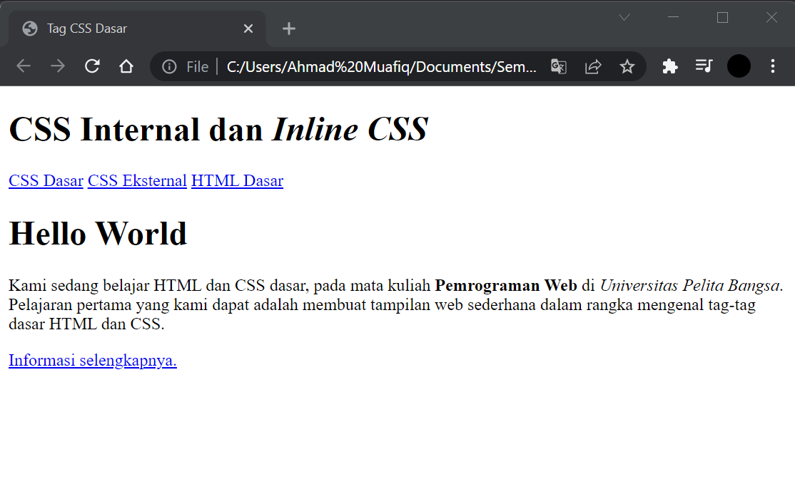
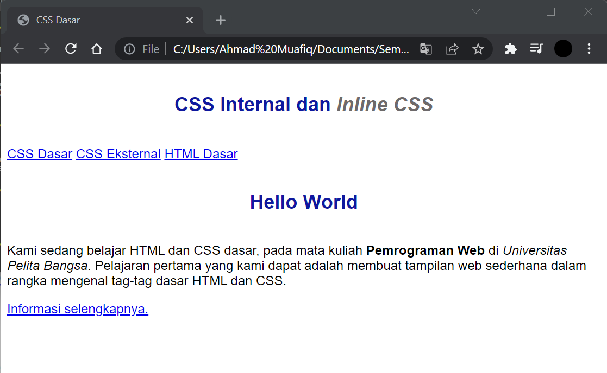
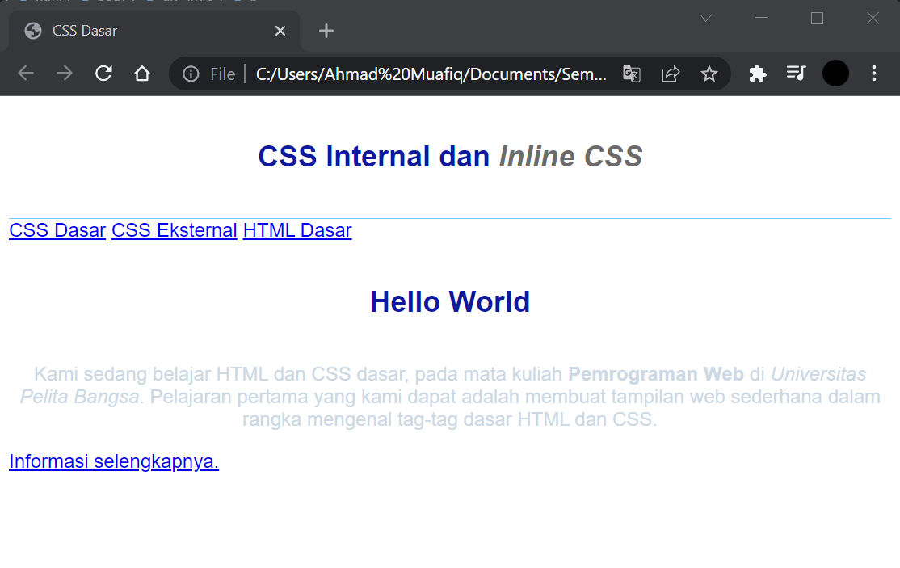
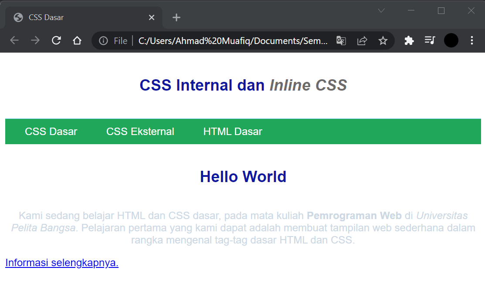
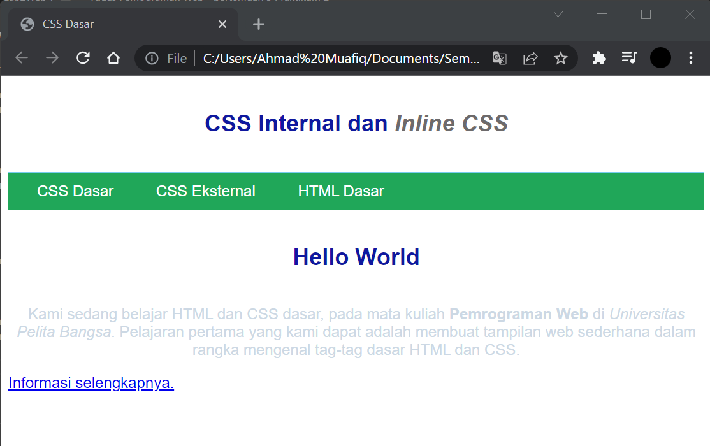

# Lab2Web
## Tugas Pemograman Web - pertemuan 3 Praktikum 2

Nama  : Ahmad Muafiq 
NIM   : 312010152 
Kelas : TI.20.B.1 

1. Membuat dokumen HTML
*Untuk langkah awal kita membuat dokumen HTML terlebih dahulu. Berikut tampilannya* 

2. Mendeklarasikan CCS Internal
nah selanjutnya kita mendeklarasikan CCS Internal. Berikut untuk tampilannya

3. Menambahkan Inline CSS
lalu kita menambahkan deklarasi inline CSS. Berikut tampilannya

4. Membuat CSS Eksternal
setelah itu kita membuat file baru untuk mendeklarasikan css. Berikut tampilannya.

5. Menambahkan CSS Selector
Selanjutnya menambahkan CSS Selector menggunakan ID dan Class Selector. Pada file style_eksternal.css, tambahkan kode berikut

## <b> Pertanyaan dan Tugas</b>

1. Lakukan eksperimen dengan mengubah dan menambah properti dan nilai pada kode CSS
dengan mengacu pada CSS Cheat Sheet yang diberikan pada file terpisah dari modul ini. 

2. Apa perbedaan pendeklarasian CSS elemen h1 {...} dengan #intro h1 {...}? berikan
penjelasannya! 

3. Apabila ada deklarasi CSS secara internal, lalu ditambahkan CSS eksternal dan inline CSS pada
elemen yang sama. Deklarasi manakah yang akan ditampilkan pada browser? Berikan
penjelasan dan contohnya! 

4. Pada sebuah elemen HTML terdapat ID dan Class, apabila masing-masing selector tersebut
terdapat deklarasi CSS, maka deklarasi manakah yang akan ditampilkan pada browser?
Berikan penjelasan dan contohnya! <!-- 
 -->