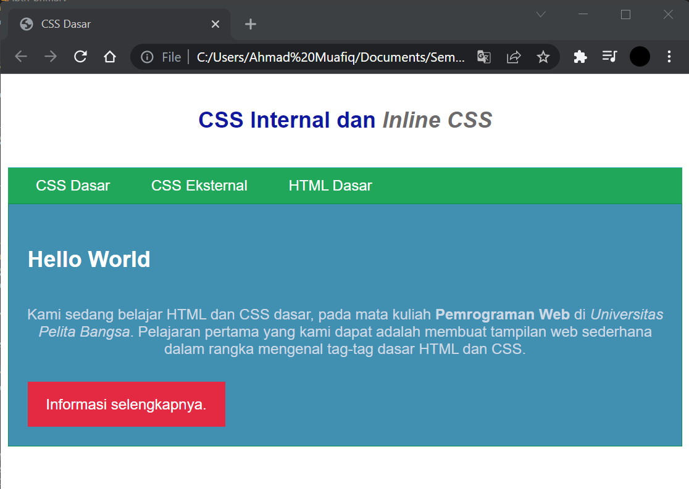

# Lab2Web
## Tugas Pemograman Web - pertemuan 3 Praktikum 2

Nama  : Ahmad Muafiq 
NIM   : 312010152 
Kelas : TI.20.B.1 

1. Membuat dokumen HTML
*Untuk langkah awal kita membuat dokumen HTML terlebih dahulu. Berikut tampilannya* 

2. Mendeklarasikan CCS Internal
nah selanjutnya kita mendeklarasikan CCS Internal. Berikut untuk tampilannya

3. Menambahkan Inline CSS
lalu kita menambahkan deklarasi inline CSS. Berikut tampilannya

4. Membuat CSS Eksternal
setelah itu kita membuat file baru untuk mendeklarasikan css. Berikut tampilannya.

5. Menambahkan CSS Selector
Selanjutnya menambahkan CSS Selector menggunakan ID dan Class Selector. Pada file style_eksternal.css, tambahkan kode berikut

